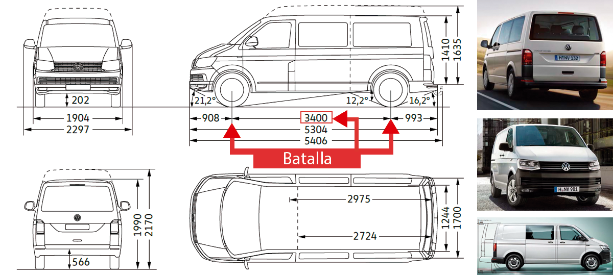
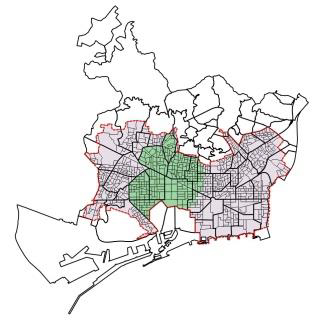

# Untitled

## **Set Up Moto**  
### jerarquía 3

1. Scooter Registration

En este primera fase, se procederá a coordinar todos los pasos para que las motos cumplan con la normativa y puedan ser puestas en la calle en la mayor brevedad.

| Column 1 | Column 2 | Column 3 | Column 4 |
| -------- | -------- | -------- | -------- |
| Text     | Text     | Text     | Text     |
| Text     | Text     | Text     | Text     |
| Text     | Text     | Text     | Text     |
| Text     | Text     | esto es una prueba    | Text     |
| Text     | Text     | Text     | Text     |
| Text     | Text     | Text     | aqui también metemos un poco de texto    |
| Text     | Text     | Text     | Text     |

Este proceso cuenta con los siguientes apartados:

* Tasa de matriculación
* Impuesto municipal de Barcelona
* Tasa del Colegio de Gestores
* Pegatina Medioambiental DGT
* Honorarios de Gestoría  
* Control producción placas acrílicas \(preferible a la metálica\) 

Hay que tener en cuenta que se aunque sean matriculadas en Barcelona, pueden ser usadas en cualquier ciudad de España si en el futuro se quieren destinar a otras ciudades.

En este primera fase Solomove, como tasa de gestión, cobrará 12 euros por moto.

Solomove, sólo trabaja con Gestoría y empresa de fabricacón de placas de primera calidad para garantizar un servicio excelente.

1. Scooter Assembly

Aquí consideramos que las motos son enviadas desde la fábrica de Silence a nuestra nave. Por seguridad, vendrán paletizadas y piezas como el baúl vendrá separado de la moto. Los cascos, por otro lado, se recibirán por separado.

En esta fase, los pasos serán los siguientes:

* Despaletizado de las motos
* Montaje accesorios \(retrovisores, etc\)
* Montaje del baúl sobre la moto
* Incluir documentación de la moto \(copia\) en el baúl
* Incluir 2 cascos \(1M y 1L\) en baúl
* Incluir accesorios en baúl \(gorritos, toallitas, etc\)
* Montaje de las matrículas sobre las motos

1. Scooter prep branding – vinyls

Nuestro equipo está preparado para poder instalar sobre la moto los vinilos necesarios tanto de frío como con calor.

A la hora de estimar el presupuesto de esta partida, hemos considerado el diseño adjunto \(poner imagen de la moto\), por el cual, para el vinilado no hay que desmontar ninguna pieza de la moto y el proceso no va a llevar más de 15 min por moto.

Si el proceso fuera diferente, deberíamos reajustar esta partida acordemente.

1. Scooter Prep Telematics

En esta fase, se comprueba que toda la parte de conectividad está funcionando correctamente. Entre estas funciones, tenemos las siguientes:

* Comprobar que el GPS de la moto ubica perfectamente
* Comprobar que el GPS de la batería ubica perfectamente
* Encendido y apagado de la moto a través de la app de usuario
* Total conectividad con la app de swapper y el backend del software
* Perfecto funcionamiento del baúl a través de la app \(ningún problema de bloqueo\)
* Otras funciones que, tras hablar con Silence, sea necesario que comprobemos

Aquellas motos que presenten errores serán solucionadas por el equipo técnico nuestro siguiendo las indicaciones del equipo técnico de Silence si fuera necesario.

1. Deployment

Esta es la última fase para poner las motos en calle. Para ello, se hace lo siguiente:

* Chequeo total de la moto \(frenos, acelerador, luces, intermitentes, presión ruedas, etc.\)
* Carga en los camiones de distribución y traslado
* Descarga de las motos en las zonas claves ya acordadas \(se va a tener claro el número de motos que van a ser descargadas en cada “hot spot”\)

#### **HUB**

1. Facilities prep + licenses and legal
2. Charging Infrastructure

**VAN Fleet**

1. **Model/s**

Los modelos de furgonetas que van a ser utilizados son…

1. Fleet Size

Para la gestión de 1,500 motos en Barcelona, tendremos:

* 7 furgonetas dedicadas a la operativa de Swappeo
* 5 furgonetas de gran tamaño cuya función principal es la de reubicación de las motos por la ciudad de una zona a otra.

1. Set Up Fleet

Para habilitar la flota de furgonetas, habrá que hacer unas adaptaciones dentro de la estructura que permitan una mayor eficiencia para operar el model S02.

### **MAINTENANCE**

En este apartado, el objetivo principal es tener en taller solo aquellas motos que realmente lo necesiten. Por tanto, tendremos un KPI clave que será el % de motos en mantenimiento sobre la flota total medio al mes. En un principio, este % nunca deberá ser superior al 10% con el claro objetivo de acabar el primer año lo más cerca posible del 5%.

**KPI mantenimiento = 10%**

1. General Maintenance & Repairs + HC

En esta partida se incluye la operativa diaria de nuestro equipo de mecánicos. Operativa que permite la salida de la moto en el mismo día que entra \(cambio de piezas, ajuste dirección, etc\) en aquellas que tengan daños leves. También es el equipo que gestiona las reparaciones de mayor nivel y que pueda implicar más de un día en taller \(conectividad, accidente grave, etc.\)

Este equipo constará de 12 profesionales totalmente cualificados y que habrán recibido un “training” en detalle del modelo S02 con su listado de errores y piezas más frágiles.

También tienen formación en cuanto a procesos a seguir en caso de accidente a la espera de peritaje.

1. Spare Part Management

Este apartado es clave para cumplir con los siguientes objetivos:

* Tener siempre stock disponible de repuestos cuando se necesite. Cuellos de botella en este apartado es lo que creará tapones en taller que no pueden salir a calle.
* Controlar el coste de la partida de repuestos. Cuanto más preciso se es este apartado mayor eficiencia en costes.

Para evitar cualquiera de estos dos importantes riesgos, en Solomove llevamos un control exhaustivo sobre el historial de repuestos usados y cuándo es necesario lanzar pedidos a fábrica para no tener roturas de stock.

1. Guarantee Mangement

Desde Solomove realizaremos la gestión de repuestos o partes de la moto que estén bajo garantía y de la cual será responsable Silence.

**ADMIN**

El departamento de Administración es clave en la operative del día a día. En Solomove, Admin tiene diferentes funciones, de las que destacan las siguientes:

* **Gestión de Accidentes**

Desde Admin son los encargados de comunicación con el Call Center, Tráfico y Taller para recibir los detalles de los sucedido, ir a recoger la moto dañada y gestionar el proceso de reparación en coordinación con el seguro para el peritaje.

Además, todo el proceso administrativo para la depuración de responsabilidades sobre los costes generados.

* **Gestión de Motos Vandalizadas**

Cualquier moto que sea detectada como vandalizada, requerirá un proceso de recopilación de información detallada de lo sucedido para poner en marcha el proceso de denuncia ante las autoridades.

* **Multas**

Gestión del cobro de multas a usuarios por diferentes motivos recogidos en los T&C de Xmoba. Este apartado se lleva conjuntamente con una empresa externa especializada en estos cobros.

* **Recursos Humanos**

Control del estado de nuestro equipo y en constante actividad para detector potenciales talentos a incorporar al equipo. Gestión altas y bajas.

* **Grúas**

Ejecución de los trámites administrativos necesarios para que el equipo de Jockeys puedan retirar las motos del depósito.

**OPERATION**

1. Swapping

La operativa de swappeo es clave en la empresa. Es la parte del equipo que está en la calle y cuyas funciones principales son las siguientes:

* Cambio de baterías en calle
* Ajustes menores de la moto en calle
* Limpieza en calle
* Reponer cascos robados \(si fuera el caso\)
* Comprobar que el baúl cuenta con los productos necesarios para los clients
* Chequeo completo de la moto tanto de conectividad como de funcionamiento \(luces, bocina, freno, etc\)

La operativa es 24/7 y tanto a su salida de la nave como a su vuelta hay un control detallado realizado por el personal de la nave y una “check list” de todo con lo que salen y de todo con lo que vuelven.

Nuestros vehículos de swappeo llevan control de GPS, lo que nos permite hacer un seguimiento real de los movimientos de la flota y optimizar constantemente las rutas para una mayor eficiencia en esta parte de la operativa.

1. Jockeys

Esta parte del equipo está especializada en ir resolviendo incidencias que puedan ir surgiendo durante el día \(retirada de motos, ir a depósito, etc\)

1. Reubicadores

Trabajan durante el día para colocar las motos listas de taller y algunas reubicaciones, pero fundamentalmente durante la noche que es cuando se dedican fundamentalmente a reubicar motos de unas zonas a otras para que estén en las zonas de mayor demanda por la mañana.

1. Tráfico \(Coordinación y Distribución\)

En este equipo se encuentran los empleados más analíticos. Son los encargados de:

* Elaborar las rutas para los swappers, jockeys y reubicadores
* Control de la operativa de swappers, jockeys y reubicadores
* Comunicación con los swappers en caso de accidente o vandalismo
* Recopilar la información necesaria de incidencias para Admin
* Análisis del backend e identificar tendencias de comportamiento y otros datos que permitan una ejecución más eficiente.

Es importante un alto acceso a la información para poder crear “hot spots”, mapas de calor y otras herramientas para mejores resultados. El equipo de tráfico está operativo 24/7.

1. Trainings

Gestión de cursos de “training” para todos los equipos, swappeo, tráfico y mantenimiento. Organización periódica de curso de herramientas y análisis del mapa de procesos para identificar posibles cuellos de botella y atajarlos.

1. Resources and Consumables

Aquí están todos los gastos en los que se incurre para una perfecta operativa. Desde la electricidad de carga de las baterías como de los artículos que hay que reponer en el baúl de la moto diariamente pasando por otros recursos necesarios para el día a día.

1. Vans

En esta partida está incluido el gasto de gestión de flota y su mantenimiento.

**CALL CENTER**

El departamento que va a estar en contacto con el usuario y que se encargará de lo siguiente:

* Recepción de quejas
* Gestión de alta de nuevos usuarios
* Recepción llamadas de policía por incidencias o accidents
* Recepción llamadas de usuarios por incidencias

# 1.2 What Is Science? | CK-12 Foundation

[https://www.ck12.org/book/ck-12-human-biology/section/1.2/](https://www.ck12.org/book/ck-12-human-biology/section/1.2/)

[1%202%20What%20Is%20Science%20CK-12%20Foundation%20716fc0d4f5224298808683e00217469c/f-d3A43d0b06041f0b47ff95e23741ca4c4351b824b1b180113673dc6f1fb2BIMAGE_THUMB_POSTCARD_TINY2BIMAGE_THUMB_POSTCARD_TINY.1](1%202%20What%20Is%20Science%20CK-12%20Foundation%20716fc0d4f5224298808683e00217469c/f-d3A43d0b06041f0b47ff95e23741ca4c4351b824b1b180113673dc6f1fb2BIMAGE_THUMB_POSTCARD_TINY2BIMAGE_THUMB_POSTCARD_TINY.1)

### **Ouch!**

This young man is getting a flu vaccine. You probably know that getting a vaccine can hurt — but it's usually worth it. A vaccine contains dead or altered forms of germs that normally cause a disease, such as flu or measles. The germs in vaccines have been inactivated or weakened so they can no longer cause illness, but are still "noticed" by the immune system. They stimulate the immune system to produce chemicals that can kill the *actual* germs if they enter the body, thus preventing future disease. How was such an ingenious way to prevent disease discovered? The short answer is more than two centuries of science.

### **Science as Process**

You may think of science as a large and detailed body of knowledge, but science is also the process by which this knowledge is obtained. Science uses experimentation, evidence, and logic to continuously test ideas. Over time and through repeated experimentation and testing, scientific knowledge advances.

We've been accumulating knowledge of vaccines for more than two centuries. The discovery of the first vaccine, as well as the process of vaccination, dates back to 1796. An English doctor named Edward Jenner observed that people who became infected with cowpox did not get sick from smallpox, a similar but much more severe disease (see the child with smallpox in the photo [below](https://www.ck12.org/book/ck-12-human-biology/section/1.2/)). Jenner decided to transmit cowpox to a young boy to see if it would protect him from smallpox. He gave the boy cowpox by scratching [liquid](https://www.ck12.org/c/physical-science/liquid?referrer=crossref) from cowpox sores into the boy's skin. Then, six weeks later, he scratched [liquid](https://www.ck12.org/c/physical-science/liquid?referrer=crossref) from smallpox sores into the boy's skin. As Jenner predicted, the boy did not get sick from smallpox. Jenner had discovered the first vaccine, although additional testing was needed to show that it really was effective.

[1%202%20What%20Is%20Science%20CK-12%20Foundation%20716fc0d4f5224298808683e00217469c/f-d3A2402c03a4f105202fe86bab29343909c1710586211137cbf70b60f032BIMAGE_THUMB_POSTCARD_TINY2BIMAGE_THUMB_POSTCARD_TINY.1](1%202%20What%20Is%20Science%20CK-12%20Foundation%20716fc0d4f5224298808683e00217469c/f-d3A2402c03a4f105202fe86bab29343909c1710586211137cbf70b60f032BIMAGE_THUMB_POSTCARD_TINY2BIMAGE_THUMB_POSTCARD_TINY.1)

A young child in Bangladesh is covered with skin lesions from smallpox. Until it was eradicated, this highly contagious infection caused many deaths, and those that survived were often severely scarred for life.

Almost a century passed before the next vaccine was discovered, a vaccine for cholera in 1879. Around the same time, French chemist Louis Pasteur found evidence that many human diseases are caused by germs, which earned him the title of "father of germ theory." Since Pasteur's time, vaccines have been discovered for scores of additional diseases caused by germs, and scientists are currently researching vaccines for many others.

### **Benefits of Science**

Medical advances such as the discovery of vaccines are one of the most important benefits of science, but science and scientific knowledge are also crucial for most other human endeavors. Science is needed to design safe cars, predict storms, control [global warming](https://www.ck12.org/c/earth-science/global-warming?referrer=crossref), develop new technologies of many kinds, help couples have children, and put a man on the moon. Clearly, the diversity of applications of scientific knowledge is vast!

### **Summary**

- 

    Science is a large and detailed body of knowledge. It is also the process by which this knowledge is obtained.

- 

==Science uses experimentation, evidence, and logic to continuously test ideas. Over time and through repeated experimentation and testing, scientific knowledge advances.==

- Medical advances such as the [development](https://www.ck12.org/c/biology/development?referrer=crossref) of vaccines are one of the most important benefits of science, but science and scientific knowledge are also crucial for most other human endeavors.

### **Review**

:::info
Explain why science is considered both a process and a body of knowledge*
:::

2. State three specific examples of human endeavors that are based on scientific knowledge.

3. Jenner used a young boy as a [research](https://www.ck12.org/c/chemistry/research?referrer=crossref) subject in his smallpox vaccine research. Today, scientists must follow strict guidelines when using human subjects in their research. What unique concerns do you think might arise when human beings are used as research subjects?

4. What gave Jenner the idea to develop a vaccine for smallpox?

5. Why do you think almost a century passed between the [development](https://www.ck12.org/c/biology/development?referrer=crossref) of the first vaccine (for smallpox) and the development of the next vaccine (for cholera)?

6. How does science influence your daily life?

### **Explore More**

> [Watch this eye-opening TED talk to learn why truly innovative science demands a leap into the unknown. The inspiring speaker explains how improv theater helped him find joy instead of fear in the unknown and how to use creativity in the scientific process.]

- [ ] Check out this video to learn more about the smallpox vaccine:

> 
