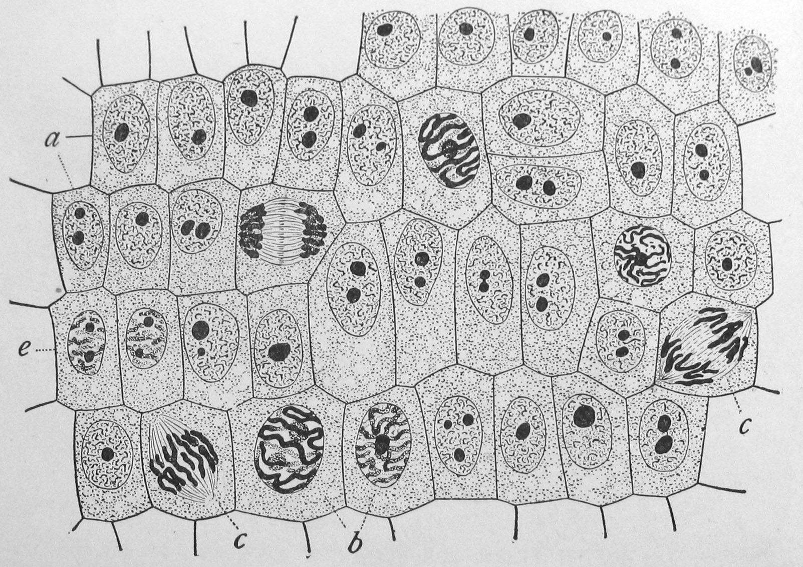

# Untitled

\[Figure1\]

**How is your** [**DNA**](https://www.ck12.org/c/biology/dna) **organized?**

Your [DNA](https://www.ck12.org/c/biology/dna) is organized into [chromosomes](https://www.ck12.org/c/biology/chromosomes), the pink structures pictured above. Your DNA doesn't always look so pretty, though. It only winds tightly into chromosomes when the cell is getting ready to divide. If your DNA wasn't organized into chromosomes, your DNA would look like a mass of strings and would be difficult to divide up!

#### Mitosis and Chromosomes 

The genetic information of the cell, or [DNA](https://www.ck12.org/c/biology/dna), is stored in the **nucleus**. During **mitosis**, two nuclei \(plural for [nucleus](https://www.ck12.org/c/biology/nucleus)\) must form, so that one nucleus can be in each of the new [cells](https://www.ck12.org/c/biology/cells) after the cell divides. In order to create two genetically identical nuclei, DNA inside of the nucleus must be copied or replicated. This occurs during the S phase of the [cell cycle](https://www.ck12.org/c/biology/cell-cycle). During mitosis, the copied DNA is divided into two complete sets, so that after **cytokinesis**, each cell has a complete set of genetic instructions.

**Chromosomes**

To begin mitosis, the DNA in the [nucleus](https://www.ck12.org/c/biology/nucleus) wraps around [proteins](https://www.ck12.org/c/biology/proteins) to form **chromosomes**. Each organism has a unique number of [chromosomes](https://www.ck12.org/c/biology/chromosomes). In human [cells](https://www.ck12.org/c/biology/cells), our DNA is divided up into 23 pairs of chromosomes. Replicated DNA forms a chromosome made from two identical **sister chromatids**, forming an "X" shaped molecule \(**Figure** [below](https://www.ck12.org/c/life-science/mitosis/lesson/Mitosis-and-Cytokinesis-MS-LS/?referrer=concept_details#x-ck12-TVNMUy0wNS0wMy1jaHJvbW9zb21lcw..)\). The two chromatids are held together on the chromosome by the **centromere**. The centromere is also where spindle fiber microtubules attach during mitosis. The **spindles** separate sister chromatids from each other.

The DNA double helix wraps around [proteins](https://www.ck12.org/c/biology/proteins) \(2\) and tightly coils a number of times to form a chromosome \(5\). This figure shows the complexity of the coiling process. The red dot shows the [location](https://www.ck12.org/c/earth-science/location) of the centromere, which holds the sister chromatids together and is where the spindle microtubules attach during mitosis and [meiosis](https://www.ck12.org/c/biology/meiosis). Notice that a chromosome resembles an "X."\[Figure2\]

**Four Phases of Mitosis**

During mitosis, the two sister chromatids must be divided. This is a precise process that has four individual phases to it. After the sister chromatids separate, each separate chromatid is now known as a chromosome. Each resulting chromosome is made of DNA from just one chromatid. So, each chromosome after this separation is made of "1/2 of the X." Through this process, each daughter cell receives one copy of each chromosome. The four phases of mitosis are prophase, metaphase, anaphase and telophase \(**Figure** [below](https://www.ck12.org/c/life-science/mitosis/lesson/Mitosis-and-Cytokinesis-MS-LS/?referrer=concept_details#x-ck12-TVNMUy0wNS0wNC1taXRvc2lzLWZsb3djaGFydA..)\).

1. **Prophase**: The chromatin, which is unwound DNA, condenses forming [chromosomes](https://www.ck12.org/c/biology/chromosomes). The DNA becomes so tightly wound that you can see them under a microscope. The membrane around the [nucleus](https://www.ck12.org/c/biology/nucleus), called the nuclear envelope, disappears. Spindles also form and attach to chromosomes to help them move.
2. **Metaphase**: The chromosomes line up in the center, or the equator, of the cell. The chromosomes line up in a row, one on top of the next.
3. **Anaphase**: The two sister chromatids of each chromosome separate as the spindles pull the chromatids apart, resulting in two sets of identical chromosomes.
4. **Telophase**: The spindle dissolves and nuclear envelopes form around the chromosomes in both [cells](https://www.ck12.org/c/biology/cells).

An overview of the [cell cycle](https://www.ck12.org/c/biology/cell-cycle) and mitosis: during prophase the chromosomes condense, during metaphase the chromosomes line up, during anaphase the sister chromatids are pulled to opposite sides of the cell, and during telophase the nuclear envelope forms.\[Figure3\]

After telophase, each new nucleus contains the exact same number and type of chromosomes as the original cell. The cell is now ready for cytokinesis, which literally means "cell movement." During cytokinesis, the cytoplasm divides and the parent cell separates, producing two genetically identical cells, each with its own nucleus. A new [cell membrane](https://www.ck12.org/c/biology/cell-membrane) forms and in plant cells, a cell wall forms as well. Below is a representation of dividing plant cells \(**Figure** [below](https://www.ck12.org/c/life-science/mitosis/lesson/Mitosis-and-Cytokinesis-MS-LS/?referrer=concept_details#x-ck12-TVNMUy0wNS0wNS1wbGFudC1jZWxsLWRpdmlzaW9u)\).  

This is a representation of dividing plant cells. [Cell division](https://www.ck12.org/c/biology/cell-division) in plant cells differs slightly from animal cells as a cell wall must form. Note that most of the cells are in interphase. Can you find examples of the different stages of mitosis?\[Figure4\]

#### Summary 

* The DNA in the nucleus wraps around [proteins](https://www.ck12.org/c/biology/proteins) to form chromosomes.
* During mitosis, the newly duplicated chromosomes are divided into two daughter nuclei.
* Mitosis occurs in four phases, called prophase, metaphase, anaphase, and telophase.

#### Explore More 

Use the resource below to answer the questions that follow.

* **Mitosis** by NDSU VCell Productions at [http://www.youtube.com/watch?v=C6hn3sA0ip0](http://www.youtube.com/watch?v=C6hn3sA0ip0) \(6:10\)

1. When does the "classic" chromosome structure of DNA appear during mitosis?
2. What problems do you think might arise if the chromosomes did not align during metaphase?
3. When do the nuclear envelopes reform? What problems might arise if a cell started forming the nuclear envelopes earlier?
4. In what stage do cells spend most of their "life"?
5. How long does mitosis take in the typical eukaryotic cell?

#### Review 

1. What are chromosomes?
2. What are the four phases of mitosis, in the correct order?
3. In what phase of mitosis are chromosomes moving toward opposite sides of the cell?
4. Compare the two nuclei that form as a result of mitosis?
5. What is cytokinesis, and when does it occur?

## Vocabulary Language: English ▼

| Term | Definition |
| :--- | :--- |
| **anaphase** | Third phase of mitosis in which sister chromatids separate and move to opposite sides of the cell. |
| **centromere** | Region of a chromosome where sister chromatids are joined together. |
| **chromosome** | Structure made of DNA and proteins that contains the genetic material of a cell. |
| **cytokinesis** | Division of the cytoplasm. |
| **metaphase** | Second phase of mitosis in which the chromosomes are aligned in the center of the cell. |
| **mitosis** | Division of the nucleus. |
| **nucleus** | Eukaryotic cell structure that contains the genetic material, DNA. |
| **prophase** | Initial phase of mitosis in which chromosomes condense, the nuclear envelope dissolves and the spindle begins to form. |
| **sister chromatids** | Two identical copies of a chromosome. |
| **spindle** | Structure that helps separate the sister chromatids during mitosis; also separates homologous chromosomes during meiosis. |
| **telophase** | Final phase of mitosis in which a nuclear envelop forms around each of the two sets of chromosomes. |

#### Image Attributions

1. \[Figure 1\] **Credit:** Edmund Beecher Wilson;Courtesy of Nogales group and Lawrence Berkeley National Laboratory **Source:** [http://commons.wikimedia.org/wiki/Image:Wilson1900Fig2.jpg](http://commons.wikimedia.org/wiki/Image:Wilson1900Fig2.jpg);[https://www.quora.com/Where-specifically-does-the-cell-cycle-occur](https://www.quora.com/Where-specifically-does-the-cell-cycle-occur) **License:** CC BY-NC 3.0;Public Domain
2. \[Figure 2\] **Credit:** Magnus Manske;Edmund Beecher Wilson **Source:** [http://commons.wikimedia.org/wiki/File:Chromatin\_chromosom.png](http://commons.wikimedia.org/wiki/File:Chromatin_chromosom.png);[http://commons.wikimedia.org/wiki/Image:Wilson1900Fig2.jpg](http://commons.wikimedia.org/wiki/Image:Wilson1900Fig2.jpg) **License:** Public Domain
3. \[Figure 3\] **Credit:** Zachary Wilson and Mariana Ruiz Villarreal \(LadyofHats\), using images by LadyofHats \(http://commons.wikimedia.org/wiki/User:LadyofHats/gallery2\);Edmund Beecher Wilson;Hana Zavadska **Source:** CK-12 Foundation;[http://commons.wikimedia.org/wiki/Image:Wilson1900Fig2.jpg](http://commons.wikimedia.org/wiki/Image:Wilson1900Fig2.jpg) **License:** CC BY-NC 3.0;Public Domain
4. \[Figure 4\] **Credit:** Edmund Beecher Wilson;Hana Zavadska **Source:** [http://commons.wikimedia.org/wiki/Image:Wilson1900Fig2.jpg](http://commons.wikimedia.org/wiki/Image:Wilson1900Fig2.jpg);CK-12 Foundation **License:** Public Domain

