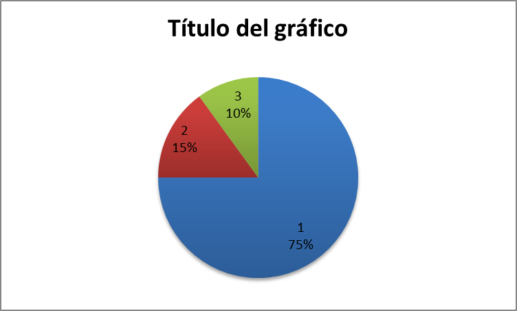

# Economy2

Unit 1 – Economy in a Global World

```text
Text prior to footnote reference.[^2]
[^2]: Comment to include in footnote.
```



>

**INDEX**

[1.]() **Introduction** …...2

[1.1. What is Economy? 2]()

[1.2. Economic sectors 2]()

[1.3. Evolution of the economic sectors in Spain 2]()

[1.4. Economic Sectors in all the countries of the world – Economic inequalities 4]()

[2.]() **Globalisation – Living in a global world** 6

[2.1. What is Globalisation? 6]()

[2.2. Factors or causes 6]()

[2.3. Consequences 6]()

[2.4. Geo-economic regions 8]()

[3.]() **Economic Systems** 8

[3.1. The communist system 8]()

[3.2. The capitalist system 8]()

[3.3. Keynesian system 9]()

[3.4. Neoliberal system 9]()

[4.]() **The Labour Market** 9

[4.1. Active and Inactive population 9]()

[4.2. Labour Market 10]()

## Introduction

### What is Economy?

Economy refers to all the activities of a country related to production, distribution, trading and consumption of **goods** and **services**. The economy of a country is measured through the **GDP** \(Gross Domestic Product\).

* **Goods** are materials that people consume in order to satisfy their needs. Goods are tangible and physical.
* **Services** are intangible products such as accounting, banking, cleaning, insurance, transportation…
* **GDP** \(Gross Domestic Product\) is the total value of all the services and goods produced by a country during a specific period of time, usually a year.
* **GDP per capita** is the total value of all the goods and services produced by a country in a particular year, divided by the number of people living there.

### Economic sectors

All the economic activities are divided into three groups called sectors:

<table>
  <thead>
    <tr>
      <th style="text-align:left">Primary Sector</th>
      <th style="text-align:left">
        <p>Economic activities that obtain resources directly from nature.</p>
        <p>Examples: agriculture, livestock farming, fishing and forestry</p>
      </th>
    </tr>
  </thead>
  <tbody>
    <tr>
      <td style="text-align:left">Secondary Sector</td>
      <td style="text-align:left">
        <p>Economic activities that transform materials into finished or semi-finished
          products.</p>
        <p>Examples: industry, energy production, mining and construction.</p>
      </td>
    </tr>
    <tr>
      <td style="text-align:left">Tertiary Sector</td>
      <td style="text-align:left">
        <p>Economic activities that produce services for people of for companies.</p>
        <p>Examples: tourism, transport, commerce, health service, education, cleaning,
          banking, programming&#x2026;</p>
      </td>
    </tr>
  </tbody>
</table>### Evolution of the economic sectors in Spain

* Till 1850 most of the people worked in the primary sector, mainly in agriculture and livestock farming \(75%\). By the other side few people worked in the secondary and tertiary sectors. Most people were farmers and lived in rural areas.
* During the 19th and 20th century the distribution changed considerably due to the industrial revolution and the modernisation of industry. Most of the population worked in the secondary sector \(55%\), while the primary sector needed fewer workers thanks to mechanisation \(20%\). The tertiary sector was increasing, but still not very important \(25%\). Many people moved from rural areas to the cities \(rural exodus\).
* After the oil crisis in 1975 the secondary sector started a critical period and lost many workers, in part due to the crisis and in part due to mechanisation and the use of robots \(27%\). The tertiary sector became the most important sector \(70%\), due to the improvement of living conditions people could have access to more services. The primary sector needed fewer workers thanks to the use of machines \(3%\).

<table>
  <thead>
    <tr>
      <th style="text-align:left"><b>1700 - 1850</b>
      </th>
      <th style="text-align:left"><b>1850 &#x2013; 1975</b>
      </th>
      <th style="text-align:left"><b>1975 - Nowadays</b>
      </th>
    </tr>
  </thead>
  <tbody>
    <tr>
      <td style="text-align:left">
        <p>
          
        </p>
        <p>Primary: 75%</p>
        <p>Secondary: 15%</p>
        <p>Tertiary: 10%</p>
      </td>
      <td style="text-align:left">
        <p>
          
        </p>
        <p>Primary: 20%</p>
        <p>Secondary: 55%</p>
        <p>Tertiary: 25%</p>
      </td>
      <td style="text-align:left">
        <p>
          
        </p>
        <p>Primary: 3%</p>
        <p>Secondary: 27%</p>
        <p>Tertiary: 70%</p>
      </td>
    </tr>
  </tbody>
</table>

* In this graph you can see in a different way the evolution of the three economic sectors through history.


### Economic Sectors in all the countries of the world – Economic inequalities

Depending on the economic situation of a country the distribution of the economic sectors will vary.

We can distinguish between the following countries:

* **LEDCs** \(Less Economically Developed Countries\), also known as **Underdeveloped Countries**.
* **NIC** \(Newly Industrialised Country\), also known as **Emerging Countries**.
* **MEDCs** \(More Economically Developed Countries\), also known as **Developed Countries**.

| **LEDCs** | **NICs** | **MEDCs** |
| :--- | :--- | :--- |
| \(People employed in each sector\) |  |  |
|  |  |  |


<table>
  <thead>
    <tr>
      <th style="text-align:left"><b>LEDCs</b>
      </th>
      <th style="text-align:left"><b>NICs</b>
      </th>
      <th style="text-align:left"><b>MEDCs</b>
      </th>
    </tr>
  </thead>
  <tbody>
    <tr>
      <td style="text-align:left"><b>Primary Sector</b>
      </td>
      <td style="text-align:left"></td>
      <td style="text-align:left"></td>
    </tr>
    <tr>
      <td style="text-align:left">Most of the people work in the primary sector. The technology is traditional
        and they produce crops for their consumption.</td>
      <td style="text-align:left">Less people work in agriculture because they start working in industries
        and also because of the use of machinery in agriculture (tractors, harvesters...).
        Anyway the amount of people that work in agriculture is still important.</td>
      <td
      style="text-align:left">Few people work in this sector, due to the use of machinery and to the
        fact that proportionally more people work in the other sectors. Very advanced
        technology and machinery. The production is aimed to internal and international
        markets.</td>
    </tr>
    <tr>
      <td style="text-align:left"><b>Secondary Sector</b>
      </td>
      <td style="text-align:left"></td>
      <td style="text-align:left"></td>
    </tr>
    <tr>
      <td style="text-align:left">It is not very developed. It is based on traditional technology and obsolete
        machinery. It&#x2019;s not competitive.</td>
      <td style="text-align:left">Multinationals install industries in these countries in order to take
        advantage of cheap labour and the emergent market. They have access to
        modern machinery, although they depend of foreign technology because the
        patents belong to the multinationals.</td>
      <td style="text-align:left">Although some years ago the proportion was very high (55%), nowadays industry
        has lost importance due to the increase of the tertiary sector and the
        introduction of machines, robots and computers (25%)</td>
    </tr>
    <tr>
      <td style="text-align:left"><b>Tertiary Sector</b>
      </td>
      <td style="text-align:left"></td>
      <td style="text-align:left"></td>
    </tr>
    <tr>
      <td style="text-align:left">It is not very developed either. It is not specialised, it doesn&#x2019;t
        require training and is based in informal jobs.</td>
      <td style="text-align:left">It is becoming more important because the standards of living are increasing
        and people demand more specialised services in education, health care,
        transport, retail&#x2026;</td>
      <td style="text-align:left">The majority of the population work in tertiary activities, such as hospitals,
        schools, banks, leisure industry, Information Technology (IT)&#x2026;</td>
    </tr>
    <tr>
      <td style="text-align:left"><b>Others</b>
      </td>
      <td style="text-align:left"></td>
      <td style="text-align:left"></td>
    </tr>
    <tr>
      <td style="text-align:left">This country is in the early stages of development. In general the salaries
        are very low. It&#x2019;s still a poor country with low standards of living
        and low demand for manufactured products.</td>
      <td style="text-align:left">
        <p>The standards of living are increasing and the internal market is becoming
          more important.</p>
        <p>The economic development is increasing too.</p>
      </td>
      <td style="text-align:left">There are high standards of living and the internal market is well structured
        and with a high level of consumption.</td>
    </tr>
    <tr>
      <td style="text-align:left"><b>Trade</b>
      </td>
      <td style="text-align:left"></td>
      <td style="text-align:left"></td>
    </tr>
    <tr>
      <td style="text-align:left">They sell raw materials that are cheap and they cannot buy expensive machinery
        or manufactured goods in return.</td>
      <td style="text-align:left">There are more exports of manufactured products.</td>
      <td style="text-align:left">These countries import cheap raw materials and export expensive manufactured
        products</td>
    </tr>
  </tbody>
</table>## Globalisation – Living in a global world

### What is Globalisation[\[1\]]()?

Globalisation is a term that describes the current economic situation where the exchanges and connections between countries have reached a maximum level.

We can say that globalisation is the process of international integration of the economies and cultures of the world. Goods, services, people, ideas and cultures are exchanged between countries at a level not known so far.

### Factors or causes

Some factors have helped to promote Globalisation. These factors are:

* **The improvement of transport** that helps to increase the transportation of goods and people all around the world.
* **The progress of communication** that facilitates companies to communicate and transfer information. This is essential for **outsourcing\***.
* **The expansion of the capitalist system.** Many countries have accepted the capitalist system and its policy of promotion of free trade. This tendency has increased the exchange of goods, services, capital, ideas and cultures.
* **The role of international organisations,** such as WTO \(World Trade Organisation\), G-8, G-20, EU \(European Union\). These organisations promote free trade all over the world.
* **The role of multinational** that are interested in the growth of this phenomenon[\[2\]](), as it helps to increase their benefits.

### Consequences

We can divide the consequences in two groups, positive and negative consequences.

**Positive consequences**

* The global market is bigger. The global market refers to all the transactions that are made all around the world: goods, capitals, services…
* The exchange of goods and services is easier and more accessible.
* Production is organised in a worldwide scale. Some countries can be specialised in some goods, or manufactured products or services, depending on their physical and human conditions.
* **Economies of scale** are more profitable.


* Multinationals increase their profits. They will have access to cheap raw materials and cheap labour of LEDCs and they will be able to sell the manufactured products or services in the MEDCs.

**Negative consequences**

* Poor countries will be exploited.
* Loss of jobs in developed countries when a multinational move the factory to countries with cheap labour.
* Small companies find increasingly difficult to compete with multinationals or TNCs \(Transnational Corporations\).
* Governments from underdeveloped and developed countries are influenced in their political and economic decisions by TNCs and lobbies
  * As an example of this it is always mentioned that the multinational PepsiCo controls more money than the GDP of many countries; in fact if Pepsico was a country it would be in the position number 99, in a higher position than Nepal, Macau, Slovenia, Luxembourg, Paraguay, etc.
* Accumulation of wealth by few people. 1% of the world population accumulates more wealth than the 99% of the population.
* Poor countries become poorer. The underdeveloped countries end up trapped in the vicious circle of poverty.
* Environmental problems. Multinationals exploit natural resources from poor countries without much respect for the environment. Some examples are:
  * * The exploitation of water resources in India by Coca Cola.
    * The destruction of ancient and unique forests in Russia by Ikea.
    * The destruction of the tropical rainforest in Indonesia in order to produce palm oil for the food industry.
    * The reduction of genetic diversity due to the GMOs. The multinational Monsanto \(and in general the GMOs -Genetically Modified Organisms-\) reduces the genetic diversity of plants and controls the market of seeds.
    * Some countries end up as **Dumping sites** \(vertederos\), as they receive an incredible amount of waste from developed countries.

### Geo-economic regions

The world can be divided in different regions, depending on the economic development of each one.

1. **The Triad:** includes the three most developed areas of the world: USA and Canada, European Union and Japan.
2. **The emerging countries:** they were underdeveloped countries but after a process of investment and economic growth they have improved their economic status. Some countries are Brazil, Argentina, Mexico, China, India, South Korea, Indonesia, Singapore, Taiwan, Malaysia…
3. **Regional Powers:** these are developed countries that have a great influence in their region that is usually an underdeveloped area. Some countries are: Russia, South Africa, Australia, etc.
4. **Underdeveloped countries:** these type or countries are in Africa, Latin America and Asia.

## Economic Systems

\[An **economic system** is a specific way in which a nation manages its resources, goods and services.\]

In this section you will learn the different economic systems that exist nowadays and what is the economic system of Spain.

### The communist system

This system appeared after the Russian revolution of 1917 and after World War II it spread to many countries in Europe, Asia and America, and nowadays it still exists in some countries such as North Korea, Vietnam, Laos, China and Cuba.

In the communist system the State is the owner of all the factories, companies and all the **means of production** \(capital, machinery, buildings, minerals, land…\). The system is also known as **planned economy** because the State decides what to produce, how much to produce, the prices of the products and the salaries of the workers.

The **objective** of this system is to achieve social equality, provide basic products to all the population and that the State controls the economy.

### The capitalist system

In this system the economy is regulated only by the market, because of that it is also known as **market economy**. This system appeared in the 19th century and it was inspired in the ideas of Adam Smith and David Ricardo.

This system exists in many countries nowadays; the best example is the United States of America.

**Private companies** own the **means of production**. Prices and salaries are set by the market and the law of supply and demand \(ley de la oferta y la demanda\).

The **objective** is to obtain the maximum benefit for the companies.

### Keynesian system

The **Keynesian system** appeared as a solution for the deficiencies of the capitalist system \(repeated economic crisis, oligopoly and monopoly, exploitation…\). This system appeared after the serious economic crisis of 1929, when the State intervened in economy as the only possible way to stop the crisis. It is considered a mixture between the capitalist system and the communist system, because of that it is also known as **mixed system.**

In the Keynesian system the State intervenes in economy, with legislation, creation of public companies and social policies.

The **objective** is to achieve social equality and also to limit the policies of the capitalist system.

### Neoliberal system

The **Neoliberal system** appeared in the 1990’s and is the renewed version of the capitalist system.

This system defends the total liberalisation of the economy and the non-intervention of the state in the economy.

 The **objective** is the same as in the capitalist system, to obtain the maximum benefit for the companies.

## The Labour Market

### Active and Inactive population

Did you know that unemployed people can be active population? Let’s explain this.

1. **Active population:** refers to all the people that are working **\(occupied population\)**, but also it refers to the people that is unemployed **\(unoccupied population\)**.

In general, it refers to all the people that can work and that want to work, regardless they are working or not.

1. **Inactive population:** refers to the people that are not part of the working force of a country. They can be students, pensioners[\[3\]](), housewives \(or homemakers\) and people of independent means[\[4\]]().
2.  **Activity rate:** is the percentage of people that can provide labour in a country. This rate gives you information about the possibilities of a country and also about its population.
   1. If the country is very old the active population is very low.
   2. If the country is very young the active population is low, but it will increase in the future.

Active population x 100

Total Population

1. **Unemployment rate:** it gives you information about the people that is unoccupied. It is divided by the active population, not by the total population.

Unoccupied population x 100

Active Population

### Labour Market

The labour market is ruled by the law of supply and demand. The **supply** is offered by the companies, by the state \(civil servants\) and by the workers themselves \(self-employed, freelance\) \(autónomos\); the **demand** is composed by the people that want to work.

In this labour market there are three **agents** that interact among them, they are the **Government**, the **trade unions** and the **employers’ associations** \(patronales\).

1. The **Government** passes the laws that rule the labour market, such as labour reforms, working conditions, working hours, minimum wage \(salario mínimo interprofesional\)…
2. **Trade unions** are organisations that represent workers. Trade unions are agents between workers and the Government, and also between workers and employers. Trade unions appeared in the 19th century during the industrial revolution. Their objective is to protect the rights of workers.
3. **Employer’s associations** are organisations that defend the interests of employers. They are agents between employers and the Government, and also between employers and workers. Employers’ associations try to get the best conditions for their economic activities, such as better tax conditions, economic subsidies, advantageous labour reforms…

There are still many problems that shall be confronted by the trade unions and the workers themselves, such as **unemployment**, **child labour**, **workers exploitation** and **discrimination against women**.


1. 
